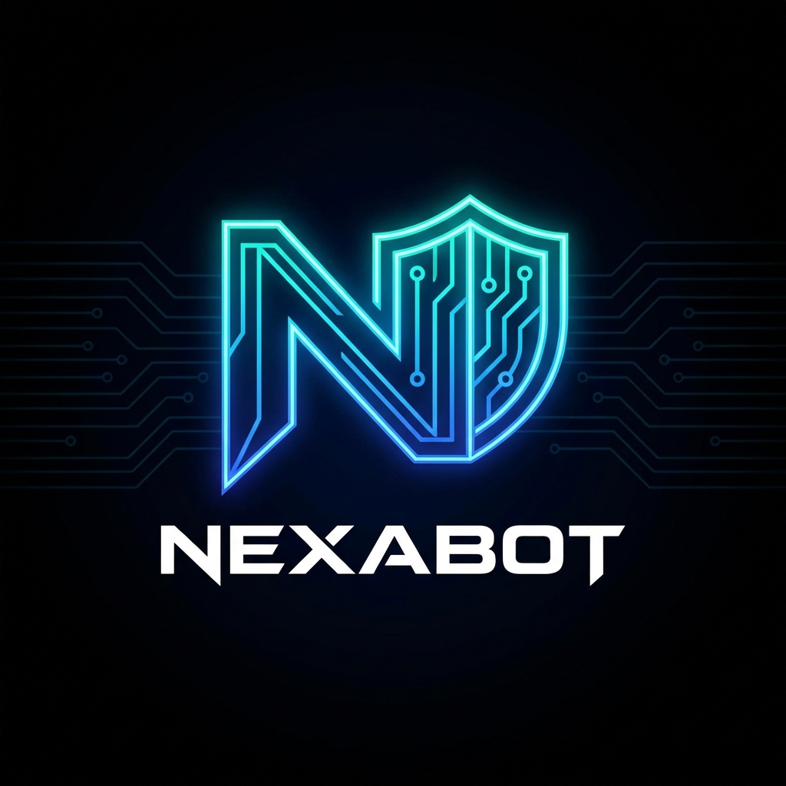

# NexaBot 🛡️
### AI-Powered Code Security & Optimization Platform


<div align="center">
  
  <p><i>Secure your code, optimize performance, and master complexity with AI.</i></p>
</div>

---

## 🚀 Overview

**NexaBot** is a cutting-edge developer tool designed to bridge the gap between coding, security, and performance. It leverages advanced Large Language Models (LLMs) via Groq to provide real-time static analysis, vulnerability detection, and algorithmic complexity optimization.

Unlike standard linters, NexaBot understands *intent*. It doesn't just find bugs; it suggests architectural improvements, auto-fixes security flaws, and provides a virtual test bench to rigorously verify code logic against edge cases.

## ✨ Key Features

*   **🔍 Deep Security Audits**: Detects vulnerabilities (SQLi, XSS, Buffer Overflows) with detailed risk assessments and fix suggestions.
*   **⚡ Complexity Analysis**: Automated Big-O Analysis (Time & Space) with concrete recommendations to reduce complexity (e.g., O(n²) → O(n)).
*   **🧬 Auto-Fix & Comparison**: View original vs. optimized code side-by-side with diff highlighting.
*   **🧪 Virtual Test Bench**:
    *   **True Runtime Execution**: Runs C/C++ code in a secure, Dockerized sandbox.
    *   **AI Test Generation**: Automatically generates rigorous edge cases (boundary values, negative inputs).
    *   **Batch Verification**: Run code against 10+ generated cases instantly.
*   **📊 History & Persistence**: Save audit sessions, review past reports, and restore workspace state across sessions.
*   **🎨 Playground**: Interactive graph visualization for comparing algorithmic performance.

## 🛠️ Tech Stack

*   **Frontend**: React (Vite), Tailwind CSS, Lucide React, Recharts.
*   **Backend**: Node.js, Express, Groq SDK (Llama 3.3).
*   **Execution Engine**: Dockerized C++ Runtime (`g++`).
*   **Database/Auth**: Appwrite (Authentication & Document Storage).
*   **DevOps**: Docker, Vercel (Frontend), Render (Backend).

## 📦 Getting Started

### Prerequisites
*   Node.js (v18+)
*   Docker (for Test Bench execution)
*   Appwrite Account (Cloud or Self-hosted)
*   Groq API Key

### Installation

1.  **Clone the repository**
    ```bash
    git clone https://github.com/yourusername/NexaBot.git
    cd NexaBot
    ```

2.  **Setup Server**
    ```bash
    cd server
    npm install
    # Create .env file
    cp .env.example .env
    # Update .env with your GROQ_API_KEY
    npm start
    ```

3.  **Setup Client**
    ```bash
    cd client
    npm install
    # Create .env file
    cp .env.example .env
    # Update .env with VITE_APPWRITE_PROJECT_ID
    npm run dev
    ```

## 🐳 Docker Support

For the Virtual Test Bench to function correctly (especially on Render), the server uses a custom Dockerfile with `g++` support.

```dockerfile
# server/Dockerfile
FROM node:18-slim
RUN apt-get update && apt-get install -y g++ make python3
...
```

## 🔒 Environment Variables

**Server (`server/.env`)**
```env
PORT=5000
GROQ_API_KEY=sk_...
```

**Client (`client/.env`)**
```env
VITE_API_URL=http://localhost:5000 # or your production URL
VITE_APPWRITE_PROJECT_ID=...
```

## 🛡️ License

This project is licensed under the MIT License.

---

<p align="center">Made with ❤️ by Kavya Singhal</p>
